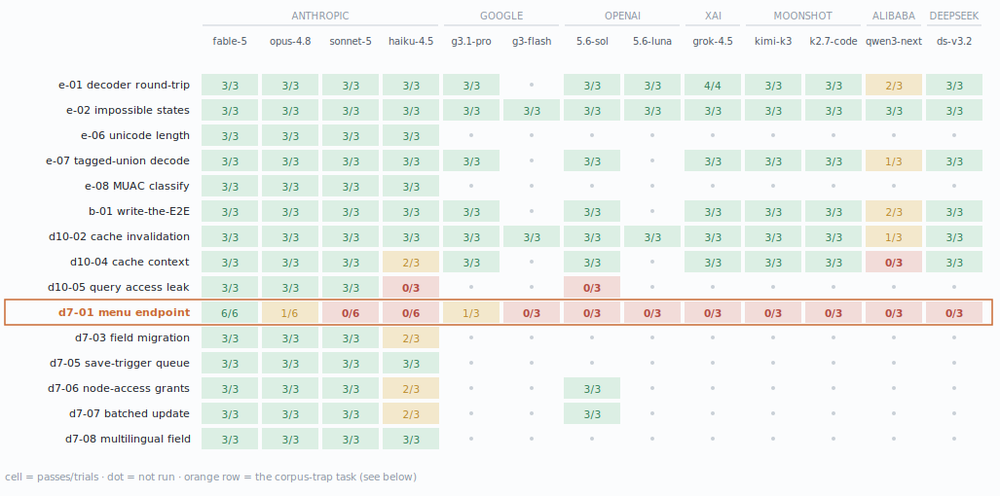
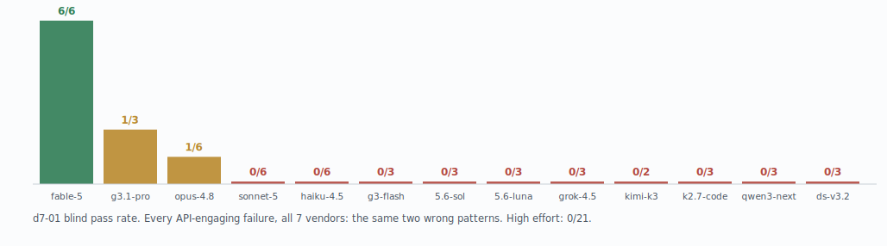
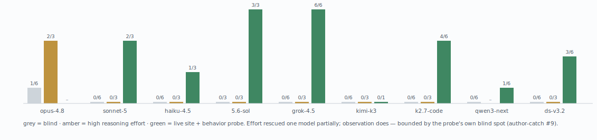
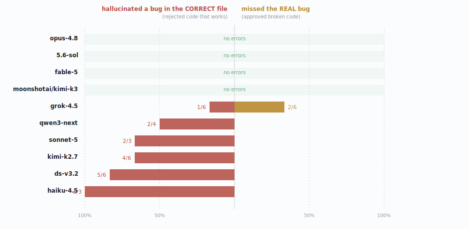

# agentic-delivery-evals

A test suite that measures how well AI coding agents handle real-world work — and where they quietly fail.

It covers two under-measured territories: **Drupal** (the CMS platform behind a large share of institutional websites, in both its modern version 10 and its legacy 2011-era version 7) and **Elm** (a typed functional language for web apps). The tasks are modeled on the real workflow behind a production digital-health platform. This repo is the measurement layer of the [agentic-delivery-harness](https://github.com/anvmn/agentic-delivery-harness); every claim below is regenerable from machine-readable receipts in `results/runs.jsonl`.

> **The short version:** we gave 13 AI models from 7 vendors (Anthropic, Google, OpenAI, xAI, Moonshot, Alibaba, DeepSeek) 15 coding tasks — 370 graded runs. Nearly every model passed nearly everything, including tasks deliberately engineered to be treacherous. But one task splits the field dramatically, and the reason became the central finding: **models fail where the internet contains a popular wrong answer but not the warning about it.** Every vendor's models fall into the same two wrong patterns on that task (the 2026-07 five-model cross-lab column went **0/30** blind at n=6), raising reasoning effort has rescued exactly one model, partially (Opus 1/6 blind → 2/3 at max; the other eight blind-failers: 0/24 at raised effort), and AI code reviewers hallucinate in both directions on the same code AI authors write correctly.

## The scoreboard (suites 0.1–0.3 · 370 runs · 13 models, 7 vendors · 2026-07-22)

<picture>
  <source media="(prefers-color-scheme: dark)" srcset="docs/charts/heatmap-dark.svg">
  
</picture>

Each cell shows passes/attempts ("tier" = intended difficulty, 1–3; charts regenerate from receipts via `scripts/render_charts.py`). The flat table, for copy-paste and diffing:

| task | lane | tier | fable-5 | opus-4-8 | sonnet-5 | haiku-4-5 | g3.1-pro | g3-flash | 5.6-sol | 5.6-luna | grok-4.5 | kimi-k3 | kimi-k2.7c | qwen3-next | ds-v3.2 |
| --- | --- | --- | --- | --- | --- | --- | --- | --- | --- | --- | --- | --- | --- | --- | --- |
| e-01 decoder round-trip | elm | 1 | 3/3 | 3/3 | 3/3 | 3/3 | 3/3 | — | 3/3 | 3/3 | 4/4 | 3/3 | 3/3 | 2/3 | 3/3 |
| e-02 impossible states | elm | 2 | 3/3 | 3/3 | 3/3 | 3/3 | 3/3 | 3/3 | 3/3 | 3/3 | 3/3 | 3/3 | 3/3 | 3/3 | 3/3 |
| b-01 write-the-E2E | behavioral | 2 | 3/3 | 3/3 | 3/3 | 3/3 | 3/3 | — | 3/3 | — | 3/3 | 2/3 | 3/3 | 2/3 | 3/3 |
| d10-02 cache invalidation | drupal10 | 2 | 3/3 | 3/3 | 3/3 | 3/3 | 3/3 | 3/3 | 3/3 | 3/3 | 3/3 | 3/3 | 3/3 | 1/3 | 3/3 |
| **d7-01 menu endpoint** (two independent runs) | **drupal7** | **2** | **6/6** | **1/6** | **0/6** | **0/6** | 1/3 | 0/3 | 0/3 | 0/3 | **0/3** | **0/3** | **0/3** | **0/3** | **0/3** |
| d7-03 field migration | drupal7 | 3 | 3/3 | 3/3 | 3/3 | 2/3 | — | — | — | — | — | — | — | — | — |
| d7-05 save-trigger queue | drupal7 | 3 | 3/3 | 3/3 | 3/3 | 3/3 | — | — | — | — | — | — | — | — | — |
| e-06 unicode length | elm | 3 | 3/3 | 3/3 | 3/3 | 3/3 | — | — | — | — | — | — | — | — | — |
| d10-04 cache context (poisoning) | drupal10 | 3 | 3/3 | 3/3 | 3/3 | 2/3 | 3/3 | — | 3/3 | — | 3/3 | 2/3 | 3/3 | 0/3 | 3/3 |
| d10-05 query access leak | drupal10 | 3 | 3/3 | 3/3 | 3/3 | 0/3 | ※ | — | 0/3 | — | — | — | — | — | — |
| e-07 tagged-union decode (oneOf) | elm | 3 | 3/3 | 3/3 | 3/3 | 3/3 | 3/3 | — | 3/3 | — | 3/3 | 3/3 | 3/3 | 1/3 | 3/3 |
| e-08 MUAC boundary classify | elm | 3 | 3/3 | 3/3 | 3/3 | 3/3 | — | — | — | — | — | — | — | — | — |
| d7-06 node-access grants | drupal7 | 3 | 3/3 | 3/3 | 3/3 | 2/3 | ※ | — | 3/3 | — | — | — | — | — | — |
| d7-07 batched $sandbox update | drupal7 | 3 | 3/3 | 3/3 | 3/3 | 2/3 | ※ | — | 3/3 | — | — | — | — | — | — |
| d7-08 multilingual field access | drupal7 | 3 | 3/3 | 3/3 | 3/3 | 3/3 | — | — | — | — | — | — | — | — | — |

*Gemini, OpenAI, and OpenRouter columns (Grok 4.5 = xAI; Kimi K3/K2.7-code = Moonshot; Qwen3-Coder-next = Alibaba; DeepSeek V3.2) cover subsets by design (— = not run; blank = not run); ※ = pending the provider's suspension appeal. Non-Claude d7-01 cells are single-run (n=3). OpenRouter rows for tasks outside the 7-task parity set are not run.*

## The story the numbers tell

### One task splits the field

<picture>
  <source media="(prefers-color-scheme: dark)" srcset="docs/charts/staircase-dark.svg">
  
</picture>

Task d7-01 asks for something a Drupal 7 developer did routinely: a small web endpoint that returns data as JSON, restricted to users with the right permission. There is a way to write it that *looks* like textbook code — the pattern is all over the internet — but silently breaks the security requirement: users who should get "access denied" (HTTP 403) instead get a friendly "200 OK" whose entire content is the number `3` (the framework's internal access-denied code, helpfully converted to JSON). That line is `'delivery callback' => 'drupal_json_output'`.

On this task, four Claude models spanning the capability range separate into a clean staircase — **Fable 5: 6/6 · Opus 4.8: 1/6 · Sonnet 5: 0/6 · Haiku 4.5: 0/6** — measured across two independent runs a day apart. Meanwhile every modern-stack task is 12/12 across those same four models. (Haiku's score was 1/6 until a grader-hardening pass: its one "pass" gamed a gap in the old check — see *A grader gap we closed* below.)

### It is not because old code is hard

The obvious explanation — "models are bad at legacy code" — was tested and failed:

- **d7-03**, a *harder*-tier legacy task (migrating a field's stored data across two database tables without losing anything): **11/12**.
- **d7-05**, deliberately stacked with **four** legacy-vs-modern API confusions at once (old queue API vs new, old variables vs the modern State API, old query API vs new, plus an idempotency requirement) and modeled on the most common backend pattern in a real production Drupal 7 platform: **12/12**.

Old and obscure APIs alone trip nobody. What's special about d7-01 is sharper: **it is the only task where the canonical-looking solution is wrong.** (The suite began from a broader *paradigm-bleed* hypothesis — models underperform where legacy conventions predate their training data's center of mass. These results gave it a precise boundary: the bleed shows up only at unwarned wrong-pattern spots, not everywhere code is old. No other public eval measures agents on legacy stacks at all.)

### There are exactly two ways models get it wrong

Every failure on d7-01 is one of two patterns — both real production hazards:

- **The delivery trap** (all 5 Opus failures, 3 of 6 Haiku failures): the one-line configuration above — looks canonical, delivers access-denied as a 200 OK with body `3`. The same trap caught the suite's human author while writing the reference solution.
- **The echo instinct** (all 6 Sonnet failures, 2 of 6 Haiku failures): printing the JSON directly inside the page handler and returning nothing, instead of returning the data through the delivery architecture the spec mandates. Deceptively, this one *works* over HTTP — we verified live: authorized requests get `200` + `application/json` + the exact JSON, because a NULL return tells D7's delivery phase "already printed" (core's own `user_autocomplete` does the same). It fails the task's *explicit* contract (criterion #3: deliver via the return value and the native delivery mechanism), not the runtime — which is exactly why it's the instinct the corpus teaches and why reviewers wave it through.
- Only Fable consistently wrote what the framework actually requires: a small custom delivery handler that routes error codes through the standard path.
- **Failure modes are stable per model:** across two runs a day apart, Sonnet *always* fails by echoing, Opus *always* by the delivery trap — ingrained instincts, not coin flips. Only Haiku, the smallest, mixes modes.

### A grader gap we closed

Tracing Haiku's lone "pass" turned up a hole in the grader, not a real solution. That run used `drupal_json_output()` + `drupal_exit()` *inside* the page handler — the print-and-exit shortcut the task explicitly forbids (criterion #3: deliver via the return value, not `print`+`exit`). It happened to satisfy the old shape-only check because `exit()` fired before the grader could spoil the output. So the grader was passing a solution the spec disallows — the grader's own version of a looks-right-but-isn't. We hardened the `authorized_json` check to require the handler to **return** `{users, nodes}` and produce **no** output (a callback that prints leaves bytes; one that exits never reaches a completion marker), self-tested it (reference passes; print+exit and print+return variants fail; the delivery trap is unaffected and still caught by the 403 check), and re-graded every d7 record from its preserved workspace. One blind record and one live-site record flipped — both Haiku, both the print shortcut — taking Haiku to 0/6 and steepening the staircase to Fable 6/6 › Opus 1/6 › Sonnet 0/6 = Haiku 0/6. Every other model uses the return-array pattern and was unchanged. Author-catch #6; details in [`VALIDATION.md`](VALIDATION.md).

The same check had a mirror-image hole, found by the cheapest model in the 2026-07-22 cross-lab column (**author-catch #9**): a solution that *returns* the array but wires **no delivery at all** passed the in-process check while serving a themed HTML page to authorized users over real HTTP. The grader now ends with a behavioral probe — grant the contracted permission to anonymous, observe the live response (status, Content-Type, exact JSON shape), revoke unconditionally — self-tested four ways (reference passes; return-without-delivery fails exactly the new stage; echo fails exactly the buffer check; the trap fails exactly the 403 check) and re-swept across all 93 preserved d7-01 workspaces. Four records flipped, all in the new column — including **three "passes" from the live-site experiment, because the probe there shares the old grader's blind spot**: it shows the anonymous status and the callback's return value, both of which look perfect for a delivery-less solution. One model iterated its probe 13 times and still shipped the hole. Lesson worth the price of the whole suite: **verification cures exactly what the verifier can see — agents inherit their test harness's blind spots.**

### We tried to build more traps on purpose — and mostly failed

If models fail where a wrong pattern is popular, we should be able to manufacture more tasks like d7-01. Two deliberate attempts:

- **v0.2 — three engineered modern traps** (Elm's Unicode text-length pitfall, Drupal 10 per-user cache poisoning, and a query access leak): frontier models dodged all three, **27/27**. Only Haiku dropped points (a crash from a missing access check, and one genuine access leak).
- **v0.3 — five harder traps** built by a 20-year veteran of these stacks actively hunting for d7-01's shape (node-access grants vs a leaky shortcut, batched-update contracts, multilingual field access, silent JSON mis-decoding, clinical boundary values): frontier models went **45/45**. Haiku dropped two trials.

The expert went **0-for-5**. Why? Famous traps are famous *because they burned people* — the warnings (blog posts, security advisories, changelogs) live in the training data right next to the bugs. d7-01's trap predates that discourse: **the corpus carries the disease without the vaccine.** So the refined finding: models fail not where code is old or hard, but **where the training corpus contains the wrong pattern and not its warning.** During development, these traps caught the human author **five times** — more often than they caught any frontier model.

### Three labs, one shared blind spot

Google's and OpenAI's models, run through the identical pipeline (thin CLI adapters; same tasks, same graders, same blind protocol):

| model | d7-01 | failure stage | failing line |
| --- | --- | --- | --- |
| gemini-3.1-pro-preview | 1/3 | anon_403 | `'delivery callback' => 'drupal_json_output'` |
| gemini-3-flash | 0/3 | anon_403 | `'delivery callback' => 'drupal_json_output'` |

- **Google:** Pro escapes the trap at the same roughly 1-in-3 rate as Opus; Flash never does — and every failure is the *same line of code*. Beyond the trap, Pro went **18/18** on a six-task subset (including the engineered cache-poisoning trap) and Flash passed both floor-calibration tasks **6/6**.
- **OpenAI:** GPT-5.6 Sol (the flagship) went **0/3** on d7-01 — one delivery-trap failure (same line again), two echo failures. It matched Pro's **18/18** on the same subset, then ran the three tasks Google's suspension left unmeasured: **8/9**. Luna (the small model) matched Flash's floor: 9/9 on calibration tasks, 0/3 on d7-01, with the same one-delivery-two-echo split as Sol.
- **The census: 39 default-effort failures on d7-01 across four labs plus three open-weights pipelines (58 counting the effort experiments below) — every failure that engages D7's delivery API falls into the same two wrong patterns.** The 2026-07-22 OpenRouter column (Grok 4.5, Kimi K2.7-code, Qwen3-Coder-next, DeepSeek V3.2) went a collective **0/12** blind: Grok and DeepSeek wrote the delivery trap 3/3 each, Kimi 3/3 (once via a hand-rolled delivery callback that JSON-encodes `MENU_ACCESS_DENIED` — the *exact* mistake that caught the suite's human author). The honest exceptions, all from the cheapest model (Qwen): one hallucinated D7 function name, one blank submission, and one solution that returns the array with **no delivery wiring at all** — which exposed [author-catch #9](#a-grader-gap-we-closed) and, at n=12-going-on-58, still no *third canonical-looking* wrong pattern from any pipeline. Notably: **zero echo failures from the four new pipelines** — the echo instinct appears to be lineage-specific, while the delivery trap is universal.

Sol's non-d7-01 drops are a finding in miniature: on the access-leak task it twice wrote the *sophisticated-looking* wrong answer — an access check that verifies permission but not published status — the exact pattern that caught the suite's human author during development ([author-catch #3 in VALIDATION.md](VALIDATION.md)) and one Haiku trial (2/6 Sol trials, 1/3 Haiku). That thinly-warned subtlety remains a **candidate second discriminator**. (These numbers were themselves corrected once: a site outage during a re-grade sweep had recorded 9 cascade-failures as real — retracted and re-audited 2026-07-23, see VALIDATION.)

Honesty notes: at n=3, Sol's 0/3 and Pro's 1/3 are statistically indistinguishable — no ranking claims. Codex-CLI runs were single-shot (~35 seconds, no live-site testing), a different agent style than the Claude runs — these are model+harness systems, compared as such. Three Gemini cells (※) are not run: the provider first hit its 250-requests/day cap (nine poisoned records voided; the runner now aborts on quota signals), then suspended the project pending an Acceptable Use appeal — plausibly triggered by this suite's own overnight quota-retry loop, a bot-shaped mistake we've documented and stopped. Cross-vendor benchmarking means inheriting every vendor's failure modes; the receipts include theirs and ours.

### Cheap models are fine — until the traps

From the cost column of the receipts: Haiku cleared 25 of 27 modern-stack trials at **$0.05–$0.16 per run**, against a frontier average of **$0.60** on the same lanes — and its only two modern-stack drops are the two engineered Drupal 10 traps. In these domains, paying for capability only pays off where the traps are.

## Two experiments on the same receipts

### Can more "thinking" fix it?

<picture>
  <source media="(prefers-color-scheme: dark)" srcset="docs/charts/levers-dark.svg">
  
</picture>


Most systems have an effort dial — more reasoning before answering. d7-01 rerun with each system's dial at its top setting, against the default results:

| model | d7-01 default | d7-01 raised effort | what changed |
| --- | --- | --- | --- |
| fable-5 | **6/6** | not run | nothing to rescue |
| opus-4-8 | 1/6 | **2/3** (`max`) | **rescued** — its passing runs ran ~2× longer and found the trap |
| sonnet-5 | 0/6 | 0/3 (`max`) | no rescue; shuffles between the same wrong patterns |
| haiku-4-5 | 0/6 | 0/3 (`max`) | no rescue |
| g3.1-pro | 1/3 | self-raised (dynamic)† | **self-rescued** — its one pass is exactly the trial where its own allocator maxed out: 9.8k thinking tokens vs 4.0k/5.6k in its fails |
| g3-flash | 0/3 | self-raised (dynamic)† | no rescue — thought up to **10.0k tokens** (more than Pro's passing trial) and still wrote the trap |
| 5.6-sol | 0/3 | 0/3 (`xhigh`) | no rescue; failures **unified** into the delivery trap — the closest-to-correct wrong answer — at ~2.5× the reasoning tokens |
| 5.6-luna | 0/3 | not run | — |

*† The Gemini CLI exposes no external effort control — the model allocates its own thinking budget per request, so these rows are observational (self-raised effort) rather than experimental. Thinking-token counts are from the run transcripts.*

The middle case: the thinly-warned access-leak subtlety (d10-05), Sol's only other drop — default **2/3**, raised effort **2/3**. No rescue there either: the failing trial wrote the identical wrong query at 2k reasoning tokens, while the passes took two different correct routes (a status condition in the query, or filtering each loaded item through an access check — the grader tests observable behavior and accepts both). All effort arms are n=3 — "no effect detected," not "no effect."

Two conclusions survive across three labs — and the Gemini pair replicates both from the *inside*, without any external knob: Pro self-rescued in the one trial its allocator chose to think ~2× harder, while Flash out-thought Pro's passing trial and stayed trapped. The tiered verdict: **effort rescues a model that is one step below the trap (Opus by external control, Gemini Pro by its own allocation); it cannot substitute for knowledge that isn't there** (Sonnet, Haiku, Sol — and Flash, at any thinking volume). And an allocation wrinkle: even told to think as hard as possible, Sol spent only ~1.3k reasoning tokens — thinking budgets follow *perceived* difficulty, and this trap's whole camouflage is looking easy. Below the threshold, only behavioral gates help.

### Can AI reviewers catch what AI authors miss?

<picture>
  <source media="(prefers-color-scheme: dark)" srcset="docs/charts/review-errors-dark.svg">
  
</picture>


All four Claude models blindly reviewed 24 graded d7-01 solutions (plus Gemini's), 95 reviews scored against grader ground truth ([`experiments/author-reviewer/`](experiments/author-reviewer/)):

| reviewer | delivery-trap catches | echo catches | good code approved |
| --- | --- | --- | --- |
| fable-5 | 12/12 | 0/6 | 7/7 |
| opus-4-8 | 6/7 | 0/2 | 2/2 |
| sonnet-5 | 7/12 | 1/5 | 6/7 |
| haiku-4-5 | 1/12 | 2/5 | 6/7 |

Three results:

- **Review skill is the same staircase as authoring skill** — and it transfers across labs (Fable rejects Gemini's trap failures 4/4; Haiku, 1/4).
- **The echo violation is near-invisible to every reviewer**: 3 catches out of 18 chances, pooled — reviewers routinely *praised* the pattern as a virtue. (It violates the task's explicit delivery criterion, though the endpoint itself functions — see above — which is precisely what makes it so approvable.)
- **False alarms stay low**: 21 of 23 good solutions approved.

Model review is a filter that inherits the reviewer's blind spots. The mechanical grader — the behavioral gate — was the floor that caught everything.

## Honest caveats

- n=3 trials per cell: error bars are wide; treat differences under ~2 tasks as noise.
- Fourteen of fifteen tasks are (nearly) saturated for frontier models. d7-01 remains the sole strong discriminator; d10-05's access-check subtlety is a candidate weak one (one Sol and one Haiku catch — far too small to call).
- Every number above is regenerable from `results/runs.jsonl` (per-run receipts: stages, duration, cost, transcript). Six Drupal 7 records are marked `regraded` after grader-fairness fixes — see [`VALIDATION.md`](VALIDATION.md).

## How it works

```text
tasks/<id>/         task.md (agent-visible spec) · fixture/ (starting state)
                    grader/ (answer key — never enters the agent workspace)
                    meta.json (lane, tier, timeout, required stages)
runner/run.sh       task × model × trial matrix over headless agents
                    (Claude Code; `gemini:`/`openai:`-prefixed models route
                    to the Gemini CLI / Codex CLI adapters in runner/agents/)
runner/report.sh    results/runs.jsonl -> RESULTS.md scoreboard
```

Design rules (full reasoning in [`SPEC.md`](SPEC.md)):

- **Mechanical grading only** — compiler, tests, linters, browser checks; no AI judge in the headline score.
- **Hidden holdouts** — the task states requirements in prose; the grader's exact checks stay outside the agent's workspace, so a model can't read the answer key.
- **Pristine tests re-imposed** — original tests are restored before grading, so "edit the test until it passes" is structurally impossible.
- **The double-fixture rule** (b-01): a test written by the agent must pass on the healthy app *and fail* on a deliberately broken variant. A test that can't fail is not a test.
- **Compile-failure as a grade** (e-02): for one task, correctness is proven by injected bad code *failing* to compile.
- **Graders are tested on themselves** — every task ships a reference solution that must pass and a flawed one that must fail at the intended stage. [`VALIDATION.md`](VALIDATION.md) logs what this caught — including five bugs in the suite author's own reference solutions.

## Run it

```bash
# one-time fixture provisioning (Drupal cores via ddev, Playwright chromium)
tasks/d7-01-menu-endpoint/provision.sh
tasks/d10-02-cache-bug/provision.sh
tasks/b-01-write-e2e/provision.sh

runner/run.sh --models "claude-opus-4-8,claude-fable-5" --trials 3 --max-cost-usd 15
runner/report.sh

# cross-lab columns (adapter routing by prefix; need GEMINI_API_KEY / a Codex CLI login)
runner/run.sh --models "gemini:gemini-3.1-pro-preview" --only d7-01-menu-endpoint
runner/run.sh --models "openai:gpt-5.6-sol" --only d7-01-menu-endpoint
```

Requirements: ddev, node ≥ 20, elm 0.19, jq, and the Claude Code CLI authenticated (plus the Gemini CLI for `gemini:` models, the Codex CLI for `openai:` models). The runner's `--max-cost-usd` is a hard cap checked before every session.

## Roadmap

Shipped so far: 15 tasks across four lanes; a 4-model Claude matrix with a test-retest replication; cross-lab columns (Gemini Pro/Flash, GPT-5.6 Sol/Luna, and via OpenRouter: Grok 4.5, Kimi K3 + K2.7-code, Qwen3-Coder-next, DeepSeek V3.2); the effort experiments (Claude max-effort arms + Sol xhigh + four-model high — one partial rescue in 27 trap runs); five review/verification experiments (author × reviewer, gen-vs-recognition, verified-review, cross-lab review with the spec-wording A/B, live-site × two cohorts); and author-catches #6–#9. What's genuinely next:

- **More labs:** OpenAI is complete to Gemini parity (adapter, subset, floor, effort arm). Next: open-weights models (DeepSeek, Qwen, Kimi) via a single Aider/OpenRouter adapter — the corpus-trap prediction stays on record for them.
- **Complete the Gemini column:** three subset cells (d10-05, d7-06, d7-07) pending the provider's suspension appeal.
- **Hunt more discriminators:** the recipe is documented (popular wrong pattern + absent corpus warning) and hard to satisfy on purpose — the author went 0-for-5. Candidate contributions welcome as issues; the D7-02 Features-module task remains unbuilt and unmeasured anywhere.
- **Tighter intervals where it matters:** raise trial counts on discriminating cells (d7-01 sits at n=6; d10-05's second camouflage layer just earned candidate status; saturated cells don't need more).
- **Effort curve:** the max-effort experiment rescued exactly one model; a low→max sweep would map the full budget-capability trade.
- **Judge lane** for code-quality dimensions — still future, still reported separately, never mixed into pass rates.

## License

[MIT](LICENSE) — © Anatoly Vaitsman
